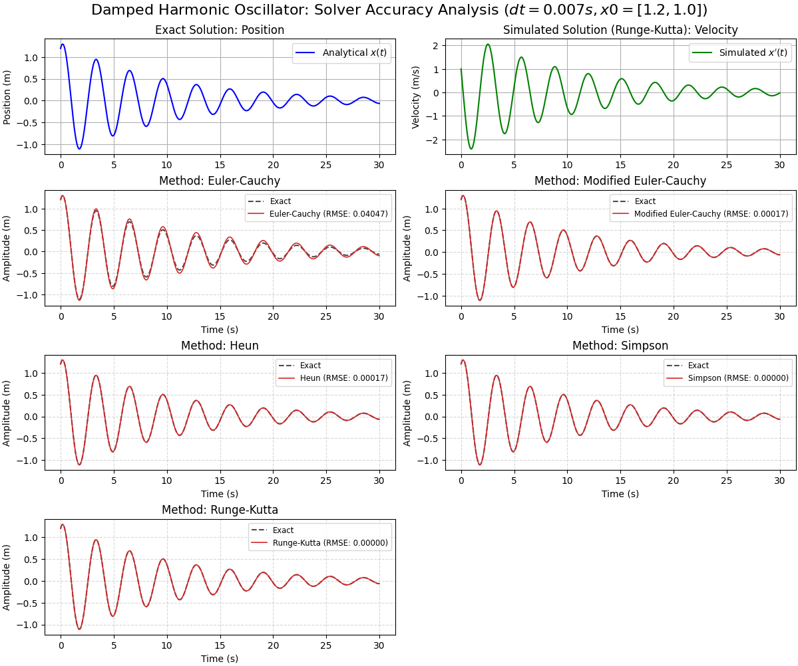

Control and Simulation Algorithms
==============
Purpose
------------
This is a collection of control and simulation algorithms, implemented in C++ and made available in python via pybind11.
I'm aware that there are better implementations of these algorithms readily available in various other C++ libraries. 
This is merely a way to keep my C++ and Control theory skills sharp.

Example output
------------

Installation
------------

 - clone this repository
 - [Optional but recommended]: 
   - `python3 -m venv .venv`
   - `source .venv/bin/activate`
 - `pip install -e .`

Usage
------------

 - Normal execution:
   - `python main.py`
 - Re-compile after changes in C++:
   - `python setup.py build_ext --inplace`
 - In case anything breaks unexpectedly or after adding dependencies:
   - `pip install -e . --force-reinstall`

License
-------
This program is provided under a GPL3 license. See LICENSE file for further information 

pybind11 is provided under a BSD-style license that can be found in the LICENSE
file. By using, distributing, or contributing to this project, you agree to the
terms and conditions of this license.

